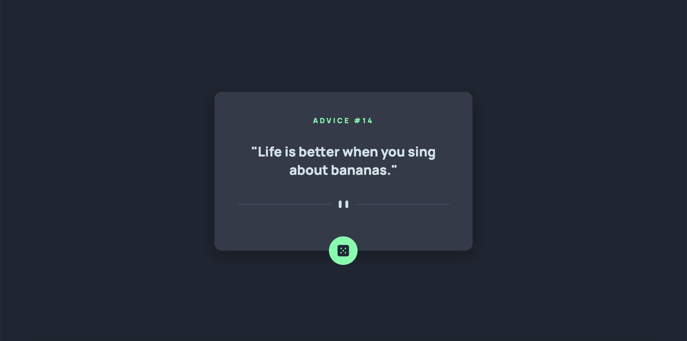

# Frontend Mentor - Advice generator app solution

This is a solution to the [Advice generator app challenge on Frontend Mentor](https://www.frontendmentor.io/challenges/advice-generator-app-QdUG-13db). Frontend Mentor challenges help you improve your coding skills by building realistic projects.

## Table of contents

- [Overview](#overview)
  - [The challenge](#the-challenge)
  - [Screenshot](#screenshot)
  - [Links](#links)
- [My process](#my-process)
  - [Built with](#built-with)
  - [What I learned](#what-i-learned)
  - [Continued development](#continued-development)
  - [Useful resources](#useful-resources)
- [Author](#author)

## Overview

### The challenge

Users should be able to:

- View the optimal layout for the app depending on their device's screen size
- See hover states for all interactive elements on the page
- Generate a new piece of advice by clicking the dice icon

### Screenshot

### Links

- Solution URL: [Advice Generator App](https://gorgeous-kitsune-0d5799.netlify.app/)

## My process

### Built with

- Semantic HTML5 markup
- CSS custom properties
- Flexbox
- Advice Slip JSON API

### What I learned

I practiced using an API on a project on my own here. It was pretty straight-forward. I also improved my layout skills here too.

### Continued development

I would love to continue using APIs and dealing with JSON data. React is also something that I want to practice using on my own.

### Useful resources

- [Display Random Advice On Your Website or Web App Using Advice Slip JSON API](https://www.youtube.com/watch?v=2AfzKmgqWUE) - This refeshed my memory on how to use the Fetch API and also how to use this advice API.

- [CSS for Button Glow Effect on Hover](https://superdevresources.com/css-button-glow-effect//) - I learned how to make the dice button glow and animate from some of the CSS here.

## Author

- Website - [Tyon Weekes](https://www.tyonweekes.com)
